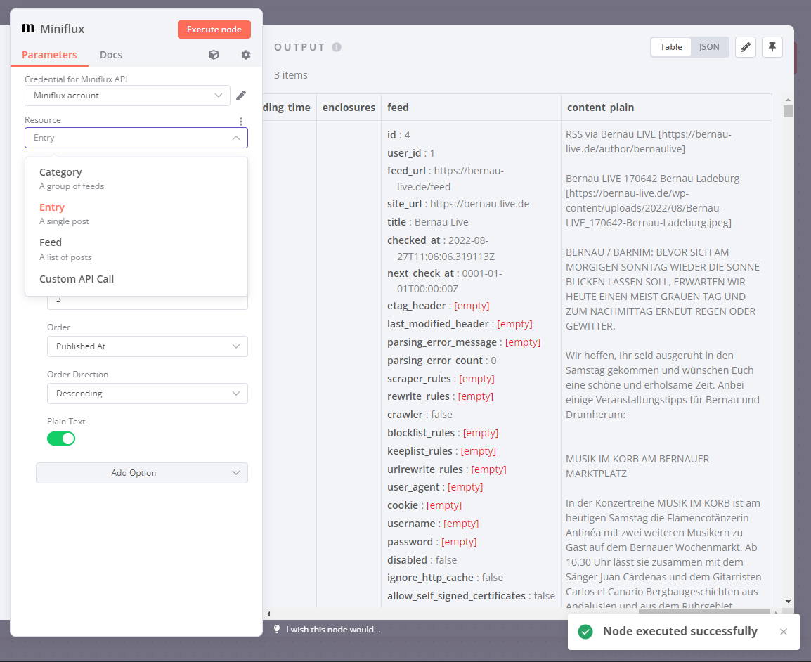

# n8n-nodes-miniflux

An [n8n](https://github.com/n8n-io/n8n) node for [Miniflux v2](https://github.com/miniflux/v2). 

n8n is a workflow automation platform, making sure you'll never have to do all these tedious and boring manual tasks again. Miniflux is the only RSS reader you'll ever need. This node brings both tools together.

So far the node can fetch your feeds, categories, and entries (with some of the filters supported by Miniflux). It can also update entries (mark them as read/unread) and utilizes some additional functionality from the [Miniflux API](https://miniflux.app/docs/api.html) such as converting HTML content into plain text on the fly.

# Installation

* [Installation guide](https://docs.n8n.io/integrations/community-nodes/installation/) for n8n community nodes
* Enter `n8n-nodes-miniflux` when n8n asks for the package name to install
* In Miniflux, head to *Settings* > *API Keys* > *Create a new API key* in order to retrieve the API key required to authenticate

# Requirements

* n8n version 1.67.1 or later (the current version of this node might work with earlier versions of n8n too, but I have only tested v1.67.1)
* Miniflux v2

# Preview

# Changelog

## 0.2.2

* Return to original name to avoid breaking existing workflows

## 0.2.1

* Version bump as I have messed up publishing the NPM package

## 0.2.0

* Added *Original Article* option ([context](https://github.com/that-one-tom/n8n-nodes-miniflux/issues/2)). This feature can potentially result in a large number of HTTP requests being sent, so make sure you start with a low limit when enabling this option. 

## 0.1.0

* Updated dependencies in line with the current n8n-nodes-starter template
* **WARNING** I was unable to get the built-in community node upgrade feature in n8n to work for the 0.0.7 -> 0.1.0 upgrade. Instead I had to first uninstall the old package and then install the new version separately through the n8n UI.

## 0.0.7

* Added *Plain Text* option. Converts HTML `content` into plain text `content_plain` when enabled.
* Order options alphabetically, renamed *Direction* into *Order Direction*
* Updated screenshot

## 0.0.6

* Merged *Feed Entry* and *Entry* resources together under *Entry*
