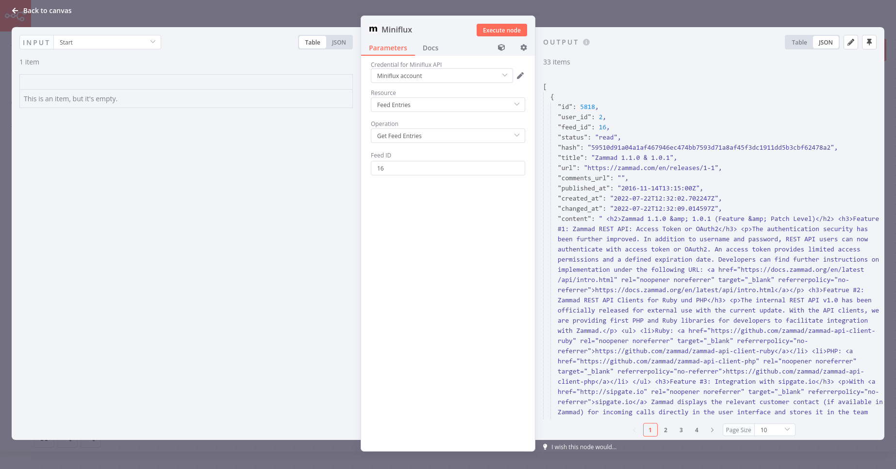

# n8n-nodes-miniflux

My first attempt at a declarative style [n8n](https://n8n.io/) node, offering a convenient way to read [Miniflux](https://miniflux.app/) feeds.

So far it can read feed entries. And that's it. It's v0.0.1 after all. But seeing I want to use this node myself I'll probably add some more stuff during the [n8n node-athon](https://n8n.io/n8n-node-athon/).

